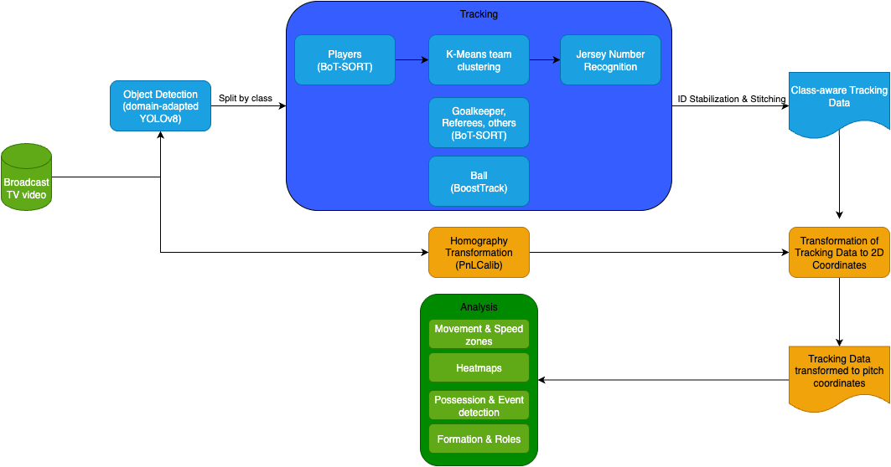

# Football Vision – End-to-End Broadcast Tracking & Analytics

Turn **single-camera TV broadcasts** into **metric player/ball trajectories** and **football insights** (distance, speed zones, heatmaps, possession proxy, formations, roles).  
The pipeline runs frame-by-frame, with class-aware tracking, jersey OCR, and per-frame homographies from **PnLCalib**.

---

## ✨ What’s inside



- **Detection:** Domain-adapted YOLOv8 (players, goalkeeper, main ref, side ref, ball, others).  
- **Class-aware tracking:** BoT-SORT for people (optional ReID on GPU), BoostTrack for the ball.  
- **Team clustering:** Simple K-Means on jersey colors with periodic refits.  
- **Jersey OCR:** PARSeq with a legibility gate and temporal voting for stable shirt numbers.  
- **Calibration:** PnLCalib keypoint/line nets → per-frame homography \(H_t\) + stability gate.  
- **Mapping:** Apply \(H_t^{-1}\) to foot points → metric pitch (105×68 m).  
- **Analytics:** Distance & speed zones, positional heatmaps, possession measuring, formations, event detection.  

---

## 🔧 Installation

```bash
pip install -r requirements.txt
```

[Download: YOLOv8n Detection Model](https://drive.google.com/file/d/12IXHinCVM11RLdvfDjxtEtJCMhZ8gpx7/view?usp=drive_link)

[Download: PARSeq_tiny Jersey OCR model](https://drive.google.com/file/d/1Xky1MpSMXt6KopSG24paXqxRNLbh3fJB/view?usp=drive_link)

[Download: Resnet34 Player crop Legibility Classifier](https://drive.google.com/file/d/1aUF4f4T5FQTEpK5tBAoQi9U4dlVwPLZs/view?usp=sharing) ([Origin-Rep0](https://github.com/mkoshkina/jersey-number-pipeline))

[Download: PnLCalib Keypoint Recognizer](https://drive.google.com/file/d/1VZtllKJKb5FeTOfR2cVGfQRjz4YzyUtm/view?usp=sharing) ([Origin-Repo](https://github.com/mguti97/PnLCalib))

[Download: PnLCalib Line Recognizer](https://drive.google.com/file/d/1Y7S_Cvrt-KvPImQFLKCeVvTEYfPXTxrm/view?usp=sharing) ([Origin-Repo](https://github.com/mguti97/PnLCalib))

---

## 🚀 Quickstart

### 1) Detection + class-aware tracking (+ OCR)

```bash
python scripts/tracking_pipeline.py \
  path/to/input_video.mp4
```

**Outputs**
- **Video preview** with overlays: `output/..._output_video.mp4`  
- **Per-frame YOLO labels** (optional): `outputDet/<seq>/labels/000001.txt`  
- **Tracking CSV (MOT-like w/ jersey):**
  ```
  frame,id,x,y,w,h,conf,class,jersey
  ```
  - `class` is a string label (e.g., `'L'/'R'` for teams, `'2'` ball, `'3'` ref, …)
  - jersey `-1` means unknown

### 2) Camera calibration (PnLCalib → homographies)

```bash
python PnLCalib/inference_modified.py \
  --weights_kp weights/hrnetv2_w48_kp.pth \
  --weights_line weights/hrnetv2_w48_line.pth \
  --input_path path/to/input.mp4 \
  --input_type video \
  --device cuda:0 \
  --batch_size 8 \
```

**Output**
- **Homographies CSV** with rows:
  ```
  frame,H00,H01,H02,H10,H11,H12,H20,H21,H22
  ```

### 3) Map to 2D + overlay pitch

```bash
python PnLCalib/transformandplotsmooth_modified.py \
  --video path/to/input.mp4 \
  --tracking path/to/tracking_results.txt \
  --transforms_csv output/homographies.csv \
  --output_video output/overlay.mp4 \
  --output_csv output/coords.csv
```

**Outputs**
- **Overlay video** with a drawn pitch and 2D points  
- **2D CSV**:
  ```
  frame,id,model_x,model_y,class,jersey
  ```
  where `model_x/y` are in meters on a **105×68 m** pitch. 

### 4) Analytics (notebook)

Open `Analysis.ipynb` and point it to the **2D CSV** to compute:
- distance & **speed zones**,
- positional **heatmaps**,
- **possession/pass proxy** (nearest-player rule to ball),
- **formation & role** clustering,
- simple **event timeline**.

---

## 📄 Data formats

**Tracking CSV (MOT-like, image coords):**
```
frame,id,x,y,w,h,conf,class,jersey
# x,y,w,h are in pixels (top-left), 'class' is string label, jersey -1 = unknown
```

**Homographies CSV (calibration):**
```
frame,H00,H01,H02,H10,H11,H12,H20,H21,H22
```

**2D Positions CSV (metric pitch):**
```
frame,id,model_x,model_y,class,jersey
# model_x in [0,105], model_y in [0,68] (after mapping and smoothing)
```

---

